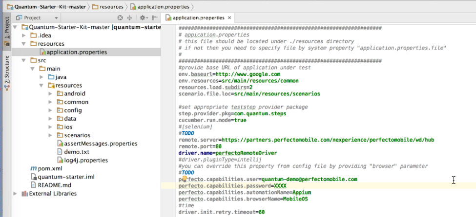
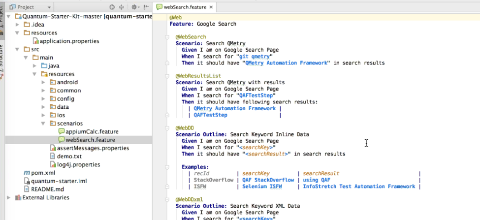
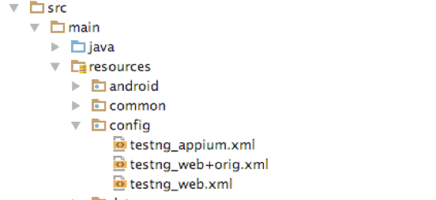
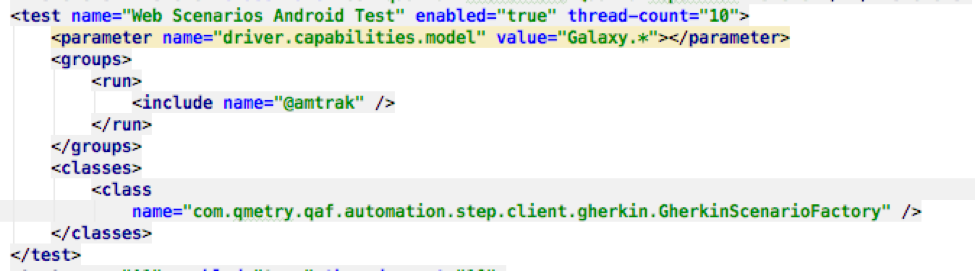
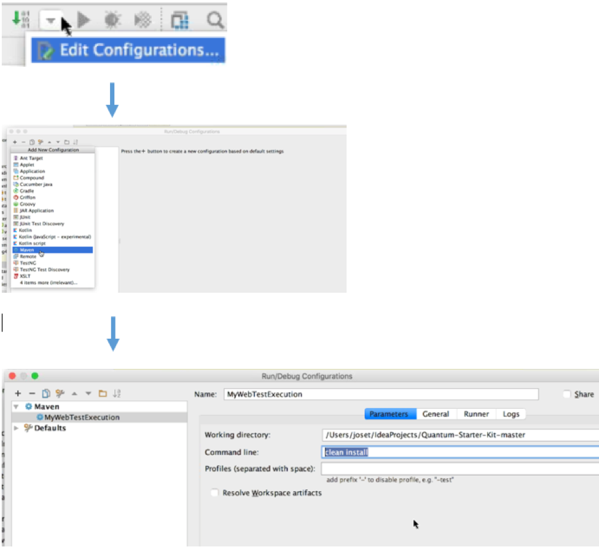

# Quantum- Step by step installation guide to intelliJ

**Step 1 - Download the project**
goto [Starter Kit](https://github.com/Project-Quantum/Quantum-Starter-Kit) and press on the button **Download ZIP**    

  
Unzip and save the project in your working area (on your computer)
  

**step 2 - import the project to IntelliJ**

* open IntelliJ and select the Import Project option:

* next, check the import project from external model and select Maven

*If you don't see Maven option, please should install the Maven plugin.*

Continue and follow the wizard [Default Next, Next ,Finish options]

* lets build the project, right click on the pom.xml file > Maven > Reimport

It can take few minutes and in the end the project should looks:  

**Step 3 - Configure the Cloud**

Goto resources > application.properties
 
 
 
 Update the following parameters:
 
**remote.server**=https://[*YourCloud*].perfectomobile.com/nexperience/perfectomobile/wd/hub
**perfecto.capabilities.user**=*Your Perfectp User*
**perfecto.capabilities.password**=*Your Perfecto Password*
  

**Step 4 - Verfiy the Feature and Test files**
Feature file is a collection of scenarios (tests), this first example show how to open browser and looks for different string in google.

  
Quantum execution is based on testNG, before the execution lets check the testNG.xml file
Goto > src > main > resources > config > testng_web.xml

The file you should see:

In the xml <test> define on device , in this case it will execute on any Galaxy device

**Step 5 - Execute**
Before executing the script we need to configure the execution on intelliJ

Please follow these steps:  

* Click on the small arrow in the top right frame
* Press the + and select Maven
* Set the name and save it
 
 
 **Press the Green Button**   
The script should be executed on the device in the cloud.

 
